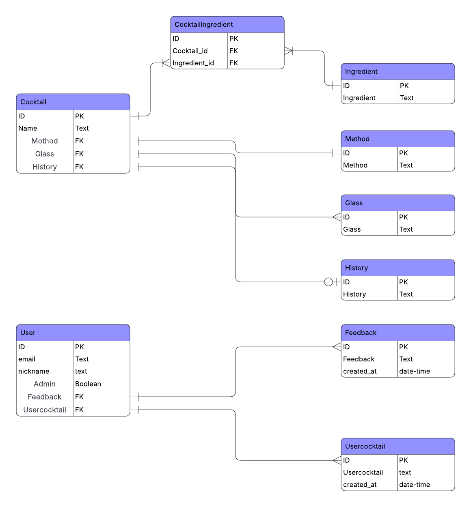

# Shaken!Stirred

Table of Contents
- [Project Overview](#project-overview)
- [User Stories](#user-stories)
- [Database Schema (ERD)](#db)
- [Tech Stack](#tech-stack)
- [Folder Structure](#folder-structure)

## Project Overview
Shaken!Stirred is a modern, visually‑driven cocktail discovery platform designed to combine style, usability, and scalable architecture. The project aims to deliver an engaging user experience through clean design, intuitive navigation, and a structured database capable of supporting future growth.
While the initial build focuses on core features such as browsing cocktails, viewing detailed recipes, and managing content through the admin interface, the long‑term vision includes user accounts, personalised features, and commercial expansion through targeted advertising.
This project serves both as a creative showcase and a technical foundation, demonstrating best practices in Django development, responsive UI design, and full‑stack planning.

## Introduction
Shaken not Stirred, known publicly as Shaken!Stirred, is currently a hobby project with long‑term commercial ambitions. While the initial build focuses on core functionality and user experience, the owner intends to expand the platform into a revenue‑generating product supported by advertising.
Because future advertising potential depends heavily on an active userbase, the ability to create, manage, and store user accounts is a key requirement from the very beginning. Establishing this foundation early ensures the project can scale smoothly as its audience grows.

## Objective
The goal of this project is to develop a website that delivers a high‑quality visual user experience supported by a robust, well‑structured database backend. The site will be built using modern coding techniques, follow best practices in Django development, and include comprehensive documentation throughout.
The final product should feel clean, responsive, and intentional — combining strong UX design with reliable, scalable architecture.

## User Stories

## Navigation bar

### As a first‑time user _(Must Have)_
I want to be able to navigate straight to the cocktails so I can start exploring the site immediately.
### Description
The site should include a clear, fixed navigation bar that provides access to all main pages. Users should be able to move around the site easily without confusion.
### Acceptance Criteria
- A fixed navigation bar is present on every page
- Navigation links are clearly labelled and easy to understand
- The “Cocktails” page is accessible directly from the navigation bar
- Navigation remains visible and functional on mobile and desktop

## Logo and Hero

### As the site owner _(Must Have)_
I want the site logo to appear on every page, and I want the landing page to feature a meaningful hero image so the site feels visually engaging from the first interaction.
### Description
The logo should be integrated into the navigation bar to ensure consistent branding across the entire site. The homepage (index.html) should include a prominent hero section with a meaningful, high‑quality image that reflects the theme and purpose of Shaken!Stirred.
### Acceptance Criteria
- The logo is displayed within the navigation bar on all pages
- The landing page includes a hero section with a visually relevant image
- The hero image loads correctly on mobile and desktop
- The hero section contributes to a strong first impression and clear brand identity

## Responsive layout

### As a user _(Must Have)_
I want to be able to view and use the site comfortably on both my mobile device and my laptop so that the experience feels consistent across all screen sizes.
### Description
The site should adapt smoothly from desktop to mobile without losing visual consistency or usability. A responsive grid system should be used to ensure that content rearranges cleanly at different breakpoints while maintaining the overall design aesthetic of Shaken!Stirred.
### Acceptance Criteria
- A responsive CSS grid layout is implemented across all pages
- Grid columns adjust through breakpoints at 6 → 4 → 2 → 1
- CSS  is used where appropriate to maintain scalable spacing, typography, and layout
- The layout remains visually consistent and functional on mobile, tablet, and desktop

### Accessibility

### As the site owner _(Must Have)_
I want the site to comply with recognised accessibility standards so that all users, regardless of ability or device, can access and use the site effectively.
### Description
The site should meet the requirements of WCAG 2.1 Level AA, ensuring that all content is perceivable, operable, understandable, and robust. This includes maintaining sufficient colour contrast, supporting keyboard‑only navigation, ensuring compatibility with screen readers, and providing a consistent, predictable experience across all pages.
Accessibility must be considered from the very beginning of development rather than added retroactively.
### Acceptance Criteria
- A consistent colour theme is used across all pages
- Both light and dark themes are available
- Colour palette meets WCAG 2.1 AA contrast ratios:
- Minimum 4.5:1 for normal text
- Minimum 3:1 for large text
- All interactive elements (links, buttons, menus, cards) are fully operable using keyboard input alone
- Screen reader support is ensured through:
- Semantic HTML structure
- Meaningful alt text for images
- ARIA labels where appropriate
- Focus states are visible, clear, and consistent
- Text can be resized up to 200% without breaking layout or hiding content
- Navigation remains predictable and consistent across the site
- No content flashes more than three times per second (to avoid seizure risk)

## POST — Add a Cocktail

### As a regular user _(Should Have)_
I want to be able to add my own cocktail so I can contribute to the collection and share my creations with others.
### Description
Users should be able to submit their own cocktails through a dedicated form. The form must be linked to the database and follow the site’s validation rules to ensure consistency and quality across all cocktail entries.
### Acceptance Criteria
- A form exists that allows users to add a new cocktail
- The form includes validation to ensure all required fields meet site standards
- Successfully submitted cocktails are stored in the site database
- Users receive clear feedback if the form is incomplete or invalid

## Administration — Manage User Cocktails

### As a site owner _(Should Have)_
I want to be able to edit, amend, and delete user‑submitted cocktails so I can maintain the quality and accuracy of the site’s content.
### Description
The site must include a secure administration area where authorised users can manage cocktail entries. This includes viewing, editing, and deleting cocktails submitted by regular users. Access should be restricted to approved administrators only.
### Acceptance Criteria
- A password‑protected administration page is available only to authorised users
- Administrators can view all user‑submitted cocktails
- A form exists that allows administrators to edit cocktail details
- Administrators can delete cocktails from the database
- A database table exists to store administrator user accounts

## Search Form — Find Cocktails by Ingredient

### As a user _(Could Have)_
I want to be able to search the cocktails so I can quickly find drinks that match the ingredients I have or prefer.
### Description
The site should include a search form that allows users to filter cocktails based on selected ingredients. Ingredient options should be validated and presented in a clear, structured way to support accurate and efficient searching.
### Acceptance Criteria
- A search form is available for users to search cocktails by ingredient
- Ingredient options are provided through validated dropdown selections
- The search returns cocktails that match the selected ingredient(s)
- Users receive clear feedback if no cocktails match their search

## Cocktail Information — View Full Cocktail Details

### As a user _(Must Have)_
I want to know how to make a cocktail so I can follow the recipe and understand what ingredients I need.
### Description
When a user selects a cocktail, the site should display clear and structured information about that drink. This includes its ingredients, method, and any available background or history. The information should be presented in an intuitive, user‑friendly way, such as through a modal or dedicated detail view.
### Acceptance Criteria
- A database table exists to store cocktail ingredients
- A database table exists to store optional cocktail history or background information
- Selecting a cocktail displays its full details in a modal or similar component
- The modal includes ingredients, method, and any available history
- The layout is clear, readable, and consistent across all cocktails

## Feedback — Collect User Feedback

### As the site owner _(Could Have)_
I want to receive feedback from my users so I can understand their experience and improve the site over time.
### Description
The site should include a simple and accessible way for users to leave feedback. This should be handled through a clear call‑to‑action and a modal form, with confirmation shown once feedback has been successfully submitted.
### Acceptance Criteria
- A feedback button is available on the site
- Clicking the button opens a modal where users can submit feedback
- The modal includes validated fields to ensure meaningful submissions
- After submitting, users see a confirmation modal indicating successful feedback submission
- Feedback entries are stored in the database for review

## Contact Information

### As the site owner _(Should Have)_
I want my contact information to be easily accessible so users can reach out if they need support or want to connect.
### Description
The site should provide a clear and visible link to the owner’s contact details. It should also include links to the site’s social media pages to help users stay connected and follow updates.
### Acceptance Criteria
- A clearly visible link to contact details is available on the site
- Links to the site’s social media pages are included and easy to find
- Contact information is presented in a clean, accessible format
- All links function correctly on mobile and desktop

## Image Buttons — Open Cocktail Details

### As a user / site owner _(Must Have)_
I want the cocktail images to act as buttons so that users can intuitively open the ingredients and details for each drink.
### Description
Each cocktail displayed on the site should use its image as an interactive element. When a user clicks or taps the cocktail image, a modal should open showing the full cocktail details, including ingredients, method, and any available history. This creates a clean, visual browsing experience and reduces the need for additional buttons or clutter.
### Acceptance Criteria
- Each cocktail image functions as a clickable button
- Clicking the image opens a modal containing the cocktail’s full details
- The modal includes ingredients, method, and optional history
- Images have appropriate hover/focus states for accessibility
- The interaction works consistently on mobile and desktop

<a id="db"></a>
## Database Schema (ERD)

Below is the full explanation of each table in the system, including its purpose and how it relates to the others.

### Cocktail
Stores all official cocktails published on the site.
These entries follow the structured format and link to lookup tables for method, glass, and history.
Fields:
- id (PK) — Unique identifier for each cocktail
- name (Text) — The cocktail’s display name
- method_id (FK → Method.id) — How the cocktail is prepared
- glass_id (FK → Glass.id) — The type of glass it is served in
- history_id (FK → History.id) — Optional historical background

Purpose:
Represents the curated, validated cocktail catalogue.

### Ingredient
Lookup table containing all possible ingredients used in official cocktails.
Fields:
- id (PK) — Unique identifier
- ingredient (Text) — Ingredient name

Purpose:
Provides a clean, reusable list of ingredients.

### CocktailIngredient
Junction table linking cocktails to their ingredients.
Implements the many‑to‑many relationship between Cocktail and Ingredient.
Fields:
- id (PK) — Unique identifier
- cocktail_id (FK → Cocktail.id) — The cocktail using the ingredient
- ingredient_id (FK → Ingredient.id) — The ingredient used

Purpose:
Allows each cocktail to have multiple ingredients, and each ingredient to appear in multiple cocktails.

### Method
Lookup table describing preparation methods.
Fields:
- id (PK) — Unique identifier
- method (Text) — e.g., “Shake”, “Stir”, “Blend”

Purpose:
Ensures consistent method naming across cocktails.

### Glass
Lookup table describing glass types.
Fields:
- id (PK) — Unique identifier
- glass (Text) — e.g., “Highball”, “Martini”, “Rocks”

Purpose:
Standardises glassware references.

### History
Lookup table containing optional historical notes for official cocktails.
Fields:
- id (PK) — Unique identifier
- history (Text) — Background story or origin

Purpose:
Allows cocktails to include optional historical context without cluttering the main table.

### User
Stores all registered users of the site, including admins.
Email acts as the unique identifier, while nickname provides a personal display name.
Fields:
- id (PK) — Unique identifier
- email (Text, unique) — User’s login identity
- nickname (Text) — Display name
- admin (Boolean) — Indicates whether the user has admin privileges

Purpose:
Represents all users in a single unified table, with admin status controlled by a Boolean flag.

### UserCocktail
Stores free‑form cocktail submissions created by users.
These do not follow the structured format of official cocktails.
Fields:
- id (PK) — Unique identifier
- user_id (FK → User.id) — The user who submitted the cocktail
- usercocktail (Text) — Free‑form cocktail description
- created_at (DateTime) — Submission timestamp

Purpose:
Allows users to submit creative cocktail ideas without enforcing structure.
These may later be reviewed and adopted into the official Cocktail table.

### Feedback
Stores general feedback messages submitted by users.
Fields:
- id (PK) — Unique identifier
- user_id (FK → User.id) — The user who submitted the feedback
- feedback (Text) — Message content
- created_at (DateTime) — Timestamp

Purpose:
Provides a simple way for users to send comments, suggestions, or issues.

## ERD



## Tech Stack

- HTML5
- CSS3
- canva.com (image editing)
- Balsamiq.com (wireframes)
- Googlefonts

- JavaScript
- JQuery
- GitHub Pages (deployment)
- GitHub Project (user stories)
- Balsamiq.com (wireframes)
- Copilot (website text articles)
- fontawesome
- w3.org (validators)
- 7timer.info (weather API)
- adobe.com (colour contrast analyzer)
- google.com (google maps)

## Folder Structure

```text

└── 📁shaken-not-stirred
    └── 📁assets
        └── 📁css
            ├── tokens.css
            └── style.css
        └── 📁favicon
        └── 📁fonts
        └── 📁images
        └── 📁js
            └── script.js
    └── 📁docs
        ├── Changelog.md
        ├── Design.md
        └── wireframe.pdf
    └── 📁screenshots
        └── wireframe.pdf
    └── 📁testing
    ├── .gitignore
    └── index.html

```