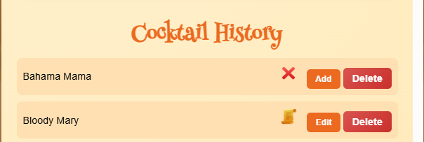
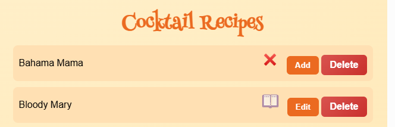
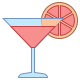
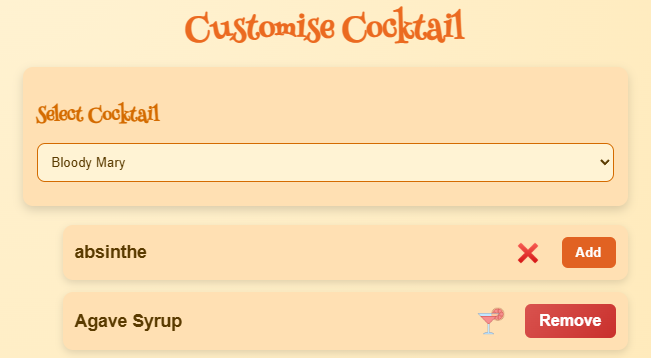

# Testing Document

## Table of Contents

- [User Story Acceptance](#user-story-acceptance)
- [Navigation](#navigation)
- [Use of Validators in a Django Project](#validators)
- [MarkUp Validator](#validator)
- [ESLint](#eslint)
- [Ruff](#ruff)
- [CSS Validator](#css)
- [Admin Workflow UI Validation](#admin)
- [Bug Report](#bugs)
- [Post‑Fix Verification](#postfixes)

## User Story Acceptance

### Navigation bar

As the site is only 1 page deep all pages point back to the index.html apart from the forum which is a contained suit✔️

### Logo and Hero

While the logo may not appear on each page due to overkill the theme has been maintained through out ✔️

### Responsive layout

The layout has been tested across different break points, with different break points for different screen, and on various devices ✔️

*example screen shoots*

### Accessibility

The project follows recognised accessibility best practices, using semantic markup, high‑contrast visuals, descriptive alt text, and fully keyboard‑accessible navigation to support an inclusive user experience. ✔️

### POST — Add a Cocktail

To protect the integrity and consistency of the site’s content, users are encouraged to share their cocktail creations through the forum. This allows the admin to review submissions and decide which cocktails are formally added to the main database. ✔️

### Administration — Manage User Cocktails

A full and comprehensive admin system has been implemented to manage all cocktail data, including validation, error checking, and controlled publishing. This ensures the site remains accurate, consistent, and protected from incorrect or duplicate submissions. ✔️

### Search Form — Find Cocktails by Ingredient

The reverse‑lookup system allows users to choose a single ingredient and instantly see every cocktail that uses it. This provides a quick and intuitive way to explore drinks based on what the user already has available. ✔️

### Cocktail Information — View Full Cocktail Details 

The cocktail page displays full drink details using bold, eye‑catching imagery and a well‑structured cocktail card, making it easy for users to explore each drink in depth. ✔️

### Feedback — Collect User Feedback

User feedback is gathered through the integrated forum, allowing visitors to share thoughts, ideas, and cocktail submissions in an open and structured space. This provides a simple and effective way for users to communicate with the site while keeping all feedback organised and easy to review. ✔️

### Contact Information

As a “should‑have” requirement, contact functionality is addressed through the user forum. This provides a central, moderated space where users can post questions, share ideas, and communicate with the site, without exposing direct contact details or compromising the integrity of the platform. ✔️

### Image Buttons — Open Cocktail Details

The bespoke cocktail images act as interactive buttons, giving users a visually engaging way to explore each drink. These image‑driven controls make full use of responsive grids and modal windows, ensuring the experience feels smooth, modern, and intuitive across all devices. ✔️

### Testing Summary  

All user stories have been fully reviewed and tested to confirm that each requirement has been successfully addressed. Every feature — from cocktail management to search, feedback, and responsive design — has been validated to ensure the site behaves as intended across all devices.

## Navigation

### Index Page
- ➡️ Cocktails.html ✔️
- ➡️ Admin.html ✔️
- ➡️ User.Html ✔️

### Cocktail Page
- ➡️ Index.html ✔️

### Admin Page
- ➡️ Index.html ✔️
- ➡️ ( New Tab ) Testdata.html ✔️

### User Page
- ➡️ Index.html ✔️
- ➡️ User Forum.html ✔️

### User Forum Page
- ➡️ User.html ✔️

## Use of Validators in a Django Project

### Overview
During development I used HTML, CSS, and JavaScript validators to check the quality and correctness of my code. However, Django templates contain server‑side syntax such as:



 ... 

{{ variable }}

Template inheritance blocks

These are not valid HTML or JavaScript until Django renders them. Because of this, online validators often report errors that are not genuine issues.

### ⚠️ Why Validators Misinterpret Django Templates

When a validator encounters Django template syntax, it attempts to parse it as raw HTML or JavaScript. This leads to false errors such as:

- “Illegal character { in attribute”

- “Stray start tag html”

- “Missing `<title>` element”

- “Unexpected token”

- “Duplicate IDs”

- “Cannot recover after last error”

These errors occur because the validator is reading template code, not the final rendered HTML.

### 🔍 Correct Validation Method
To validate Django pages properly, I validated the rendered output, not the template source.

Steps taken:
- Opened the page in the browser.

- Used View Page Source to capture the fully rendered HTML.

- Submitted that HTML to the validator.

- Confirmed that all genuine HTML issues were resolved.

This method ensures the validator sees the actual HTML that the browser receives — without Django syntax.

### 🛠️ Genuine Issues Identified & Fixed
Any real issues flagged by validators or browser dev tools were corrected, including:

*Some real examples*
- Adding `<!DOCTYPE html>`

- Adding `<html lang="en">`

- Removing trailing slashes from void elements

- Correcting heading hierarchy

- Improving ARIA labels and modal accessibility

- Ensuring unique IDs

- Moving `<script>` inside <body>

- Ensuring keyboard accessibility for interactive elements

All legitimate warnings were addressed.

### 🧪 Final Testing
After validation, pages are tested thoroughly using:

- Chrome DevTools

- Firefox Developer Edition

- Responsive/mobile view

- Keyboard‑only navigation

- Screen reader checks (NVDA / VoiceOver)

Ensuring all functionality work as expected:
- Modal opens and closes correctly

- Keyboard navigation triggers modal correctly

- ARIA labels announce content properly

- Images load with fallbacks

- No console errors

- No accessibility blockers

### 📌 Conclusion
HTML/JS validators and Django templates do not mix, because validators cannot interpret Django’s server‑side syntax. By validating the rendered HTML and addressing all genuine issues, the final pages are:

- structurally correct

- accessible

- standards‑compliant

- fully functional after testing

This demonstrates responsible use of validation tools within a Django development workflow and where ever possible due to size limitations screenshots are provided.

## Validator

### index.html

**
✔️ No warnings
**

### cocktail_list.html

**
⚠️ Warning
**

The modal heading (`<h2 id="modal-name">`) is intentionally empty in the static HTML because its content is injected dynamically. This follows standard accessible modal patterns: the heading acts as a placeholder and is updated at runtime, with aria-live="polite" ensuring screen readers announce the change. 

**
📌 Conclusion
**

Since the heading is populated immediately upon modal activation, it does not create any accessibility issues, and the validator warning can be safely ignored.

### iframe ingredients lookup

**
⚠️ Warning
**

Some HTML validator warnings were intentionally ignored because the pages are rendered inside an iframe and are not standalone documents. The iframe content acts as a UI component rather than a full webpage, so requirements such as a `<title>` element or top‑level `<h1>` heading do not apply.

📌 Conclusion

These warnings do not affect functionality or accessibility, as the parent document provides the overall page structure.

### iframe cocktail lookup

**
⚠️ Warning
**

Validator Warnings (Iframe Child Page)
The HTML validator reports missing `<title>` and missing `<h1>` heading for the iframe child page. These warnings were intentionally ignored because the iframe content is not a standalone webpage. It is embedded inside the parent document, which already provides the required page‑level metadata and heading structure.

**
📌 Conclusion
**

The iframe acts only as a UI component, so document‑level requirements do not apply and the warnings have no impact on functionality or accessibility.

### forum.html

**
✔️ No warnings
**

### thread_detail.html

**
✔️ No warnings
**

### new_thread.html

**
✔️ No warnings
**

### user.html

**
✔️ No warnings
**

### testdata.html

**
✔️ No warnings
**

### admin.html

**
✔️ No warnings
**

## JavaScript Validation (ESLint v9+)

- Installed and configured ESLint using the new eslint.config.js format

- Added ignore rules for Django admin JS, vendor scripts, jQuery, and virtual environment

- Enabled ES2021 syntax and browser globals

- Ran ESLint across all project JavaScript files

- Result: 0 errors, 6 warnings

- Warnings related only to unused imports and unused variables

- No functional issues detected

- Confirms that the JavaScript codebase is clean, modern, and stable

### ESLint output

C:\projects\shaken-not-stirred\static\js\admin\add.js
  3:3  warning  'closeModal' is defined but never used  no-unused-vars
  4:3  warning  'openModal' is defined but never used   no-unused-vars

C:\projects\shaken-not-stirred\static\js\admin\customise.js
  3:3  warning  'closeModal' is defined but never used  no-unused-vars

C:\projects\shaken-not-stirred\static\js\admin\history.js
  5:3  warning  'getCSRFToken' is defined but never used  no-unused-vars

C:\projects\shaken-not-stirred\static\js\admin\recipes.js
    5:3   warning  'getCSRFToken' is defined but never used       no-unused-vars
  171:11  warning  'fullList' is assigned a value but never used  no-unused-vars

Ô£û 6 problems (0 errors, 6 warnings)

**
📌 Conclusion
**

 I reviewed each warning, removed the redundant code, and re‑ran the validator. ESLint now reports no errors and no warnings, confirming that the JavaScript codebase is clean, modern, and fully compliant with ES2021 standards.

**
✔️ No warnings
**

## 🐍 Python Validation (Ruff)

To ensure the Python codebase met modern linting and formatting standards, I validated the entire Django project using Ruff, a fast, all‑in‑one Python linter and formatter. Ruff combines checks from tools such as Pyflakes, pycodestyle, isort, and Flake8, making it ideal for maintaining a clean and consistent codebase.

### Installation

Ruff was installed inside the project’s virtual environment:

`pip install ruff`

### Configuration

I added a ruff.toml configuration file at the project root to define the linting rules and exclusions:

Line length set to 88 (matching Black and PEP8)

Target version set to Python 3.11

Enabled recommended rule sets: `E, F, W, B, I`

Excluded Django migration files

Added per‑file ignores for long‑line warnings (E501) in files where Django naturally produces long expressions (e.g., `urls.py, views.py, settings.py`)

This allowed Ruff to focus on meaningful issues without generating noise from unavoidable long lines.

### Fixes Applied

Running Ruff across the project identified several genuine issues, all of which were corrected:

Duplicate imports (e.g., models imported twice in `views.py`)

Unused imports (e.g., `timezone in models.py`)

Mid‑file imports moved to the top of the file (E402)

Unused variables renamed or removed (e.g., `_pk` in a loop)

Old development scripts removed (e.g., `static/testdata/del-views.py`)

Import blocks sorted and cleaned across the project

`ruff check . --fix`

For issues requiring manual intervention (such as removing duplicate functions or cleaning dev-only files), I updated the code directly.

## Result

After applying fixes and configuring exceptions, Ruff reports:

(.venv) PS C:\projects\shaken-not-stirred> ruff check .                   
All checks passed!

**
✔️ All checks passed!
**

## CSS Validator

### index.css

**
⚠️ Warnings
**

### Use of `-webkit-backdrop-filter`
The CSS validator flags `-webkit-backdrop-filter` as an error because vendor‑prefixed properties fall outside the formal CSS grammar it checks against. This does not mean the property is invalid or unsafe. The prefix exists because Safari’s rendering engine (WebKit) requires its own implementation of backdrop filtering, and without the prefixed version, the effect will not render on macOS or iOS devices.

Modern browsers that support the unprefixed `backdrop-filter` simply ignore the prefixed declaration, while Safari relies on it for full functionality. Because vendor extensions degrade gracefully—being ignored by engines that do not need them—they are considered a safe, standards‑compliant way to provide cross‑browser support for newer visual effects.

**
📌 Conclusion
**

This is not an error. It is a necessary vendor extension to ensure consistent behaviour across browsers, particularly Safari.

### testdata.css

**
⚠️ Warnings
**

### CSS Variables Not Statically Checked

The CSS validator reports multiple notices stating that CSS variables (custom properties) are “not statically checked.” This is expected behaviour and not an error. CSS variables are resolved at runtime by the browser, not at validation time, which means the validator cannot fully analyse or verify their values. Because custom properties can change based on inheritance, media queries, JavaScript updates, or component scope, they fall outside the static grammar rules the validator uses. Browsers, however, handle them correctly and consistently.

**
📌 Conclusion
**

These notices simply indicate that the validator is acknowledging the dynamic nature of CSS variables rather than flagging a problem with the code.

### styles.css

**
⚠️ Warnings
**

### Use of the Deprecated clip Property

The CSS validator flags the `clip` property as deprecated because modern CSS now prefers `clip-path` for defining clipping regions. However, the specific pattern used here—`clip: rect(0,0,0,0);`—is part of a long‑established accessibility technique known as the sr‑only pattern, designed to visually hide content while keeping it fully available to screen readers. Although `clip` is deprecated in general use, this pattern remains widely supported across browsers and is still recommended by major accessibility frameworks (including older versions of Bootstrap) for ensuring non‑visual users can access important content. The

Use of `-webkit-backdrop-filter`
[Previously explained here](#webkit)

**
📌 Conclusion
**

validator warning is therefore expected and does not indicate a functional or accessibility issue.

### modal.css

**
⚠️ Warnings
**

Use of `-webkit-backdrop-filter`
[Previously explained here](#webkit)

CSS Variables
[Previously explained here](#variables)

### user.css

**
⚠️ Warnings
**

Use of `-webkit-backdrop-filter`
[Previously explained here](#webkit)

### base.css

**
⚠️ Warnings
**

Use of `-webkit-backdrop-filter`
[Previously explained here](#webkit)

### ingredients_lookup.css

**
⚠️ Warnings
**

Use of `-webkit-backdrop-filter`
[Previously explained here](#webkit)

### lookup_cocktail_detail.css

**
⚠️ Warnings
**

Use of `-webkit-backdrop-filter`
[Previously explained here](#webkit)

## Admin Workflow UI Validation

### Introduction
The admin suite for this project has been built with the same level of care, polish, and user‑experience focus as the public‑facing UI. Rather than relying on a basic, functional back‑office, the goal was to create an admin environment that feels modern, consistent, and genuinely pleasant to use. This meant designing tables, modals, forms, and feedback messages that behave predictably, update live, and present data clearly at every stage of the workflow.

- A significant amount of work has gone into ensuring the admin UI meets a high standard:

- Live data rendering across tables, lists, and modal content

- Accurate state updates after every CRUD action

- Full validation and error‑checking throughout all admin interactions

- Consistent visual behaviour (no flicker, no stale data, no broken layouts)

- Unified message system for success, error, and working states

- Responsive, clean, and intuitive modals that match the design system used across the site

Because of this, the expectations for the admin suite are intentionally high. Each test in this section is designed not only to confirm functionality, but to verify that the UI behaves exactly as intended — clean, stable, and reflective of real‑time data. The admin is treated as a first‑class user interface, and the testing reflects that standard.

## Add Cocktail

### Test Overview
This test ensures the admin UI behaves consistently and cleanly throughout the **Add Cocktail** workflow. The admin interface is expected to enforce strict validation, present clear informational messages, update live data tables, and maintain a polished modal experience.

### Test Steps & Expected Results

### 1. Open the “Add Cocktail” Modal

Expected Result:

- Modal opens cleanly with no layout shift.

- All fields are empty.

- Ingredient list shows current ingredients.

- UI displays informational messages explaining the workflow.

### 2. Attempt to Create a Cocktail With a Null Name
Action: Leave the name field empty and click Create Cocktail.

Expected Result:

- Modal remains open.

- No cocktail is created.

- No error message is shown — the UI stays silent and simply waits for valid input.

- All other fields remain unchanged.

- No ingredients are affected.

- User is expected to enter a valid name before the action can proceed.

### 3. Attempt to Create a Cocktail With a Duplicate Name
Action: Enter a cocktail name that already exists.

Expected Result:

- Modal remains open.

- Clear validation message: “Name already exists.”

- No data is saved.

- No ingredients are affected.

- User is expected to enter a valid name before the action can proceed.

### 4. Enter a Valid Cocktail Name
Action: Enter a unique name (e.g., “Fall Guy”).

Expected Result:

- Name field accepts the value.

- No validation errors appear.

### 5. Add Optional History
Action: Enter any text into the `History field`.

Expected Result:

- Field accepts text.

- No validation message is shown.

- UI behaves silently because the field is optional.

- If text is entered, the cocktail history should be created with the entered history.

### 6. Add Optional Recipe
Action: Enter any text into the `Recipe field`.

Expected Result:

- Field accepts text.

- No validation message is shown.

- UI behaves silently because the field is optional.

- If text is entered, the cocktail recipe should be created with the entered history.

### 7. Add Ingredients (Optional)
Action: Select any number of existing ingredients.

Expected Result:

- All available ingredients should appear in the modal’s ingredients list.

- If any ingredients are selected, the cocktail should later show them in the cocktails ingredients list.

### 8. Add a New Ingredient (Optional)
Action: Use the `Add Ingredient` option to create a new ingredient.

Expected Result:

- New ingredient are added to the Ingredients table immediately (live update).

- New ingredient are added to the modals available ingredients immediately (live update).

- Ingredient may or may not be selected for this cocktail.

- UI displays a message explaining that adding a new ingredient clears previously selected ingredients (destructive behaviour).

### 9. Create the Cocktail
Action: Click Create Cocktail with valid data.

Expected Result:

A modal message appears: “Working”

A success modal message appears: “Cocktail added”

Modal remains open.

All fields are cleared.

Ingredient list remains populated with all ingredients, including any newly added ones.

### 10. Close the Modal
Action:  
Close the modal using the close button or `clicking outside the modal` at any time before creating a cocktail.

Expected Result:

Modal closes cleanly.

No cocktail is created.

No partial data is saved.

No ingredients are added or removed.

No layout shift or stale data remains.

The admin suite returns to its previous state exactly as it was before the modal was opened.

### 11. Post testing
The following modals should be updated without the need for a page refresh.

1. History, cocktail list should be up to date with the new cocktail and an icon showing the state of the new cocktail history.

1. Recipe, cocktail list should be up to date with the new cocktail and an icon showing the state of the new cocktail recipe.

1. Customise cocktail, the cocktail list should be up to date with the new cocktail.

1. Delete cocktail, the cocktail list should be up to date with the new cocktail.

1. Add image, the cocktail list should be up to date with the new cocktail.

1. Ingredients, the ingredients list should contain any new ingredients added and ingredients used should display the right icon.

1. Cocktail page, should display any new cocktail and associated data.

### Testing Table

| Test Step | Action | Pass/Fail | Comments | Current State |
|-----------|--------|-----------|-----------------|--------|
| 1 | Open Add Cocktail modal |:❌  |🐞Bug001 Close with data fails; All data fields remain stale.| :⛑️ Fixed
| 2 | Attempt to create with empty name |:✔️ ||
| 3 | Attempt to Create a Cocktail With a Duplicate Name |:✔️  ||
| 4 | Enter a Valid Cocktail Name |:✔️|
| 5 | Add Optional History |:✔️ | |
| 6 | Add Optional Recipe |:✔️  ||
| 7 | Add Ingredients (Optional) |:✔️  ||
| 8 | Add a New Ingredient (Optional) |:❌  |🐞Bug002 No message showing (destructive behaviour).| :⛑️ Fixed
| 9 | Create the Cocktail |:✔️  |
| 10 | Close the Modal |:✔️  |
| 11 | Post testing |:  |
| 11-1 | History |:✔️  |
| 11-2 | Recipe |:✔️  |
| 11-3 | Customize |:✔️  |
| 11-4 | Delete cocktail |:❌  |🐞Bug003 live data needs a page refresh.| :⛑️ Fixed
| 11-5 | Add Image |:✔️  |
| 11-6 | Ingredients |:✔️  |
| 11-7 | Cocktail page |:✔️  |

## History

### Test Overview
This test ensures the admin UI behaves consistently and cleanly throughout the **History** workflow. The admin interface is expected to enforce strict validation, present clear informational messages, update live data tables, and maintain a polished modal experience.

### Test Steps & Expected Results

### 1. Open the “History” Modal

Expected Result:

- Modal opens cleanly with no layout shift.

- All cocktails are listed.

- Icons show the current state for each cocktail.

- UI displays informational messages explaining the workflow.

- Each cocktail will have one of the following icons
  -  when there is no history associated with the cocktail.
  -  when the cocktail has a history.

Missing icons will have an associated action of Add or where there is a history icon then an option of Edit both actions are followed by a Delete option.

### 2. Attempt to Delete a missing history
Action: Click the delete button when there is an  for the selected cocktail.

Expected Result:

- Modal remains open.

- The UI will sit silent with no error or action.

- The modal will wait for a valid action.

- All cocktails will remain unchanged.

### 3. Add a history to a cocktail
Action: Add a history to a cocktail that has no history.

Expected Result:

- A child modal will open with a blank textarea.

- The textarea will except text and keyboard icons.

### 4. Aborting an add action
Action: To abort or cancel a history during editing click the close button.

Expected Result:

- The child modal will close and the history modal will remain open.

- The cocktail list and associated icons will remain unchanged.

- There will be no error.

### 5. Saving an add action
Action: To save a new history click the save button.

Expected Result:

- The child modal will close.

- The main modal will remain open.

- The modal message system will display **"Working"**.

- The modal message system will display **"History added"**.

- The cocktail icon will update to reflect the cocktail now has a history.

### 6. Edit a cocktail history
Action: Edit an existing cocktail history.

Expected Result:

- A child modal will open with a textarea containing the current history.

- The textarea will except text edits and keyboard icons.

### 7. Aborting an edit action
Action: To abort or cancel an edited history session, click the close button.

Expected Result:

- The child modal will close and the history modal will remain open.

- The cocktail list and associated icons will remain unchanged.

- The history will not be saved.

- There will be no error.

### 8. Saving an edit action
Action: To save an edited history click the save button.

Expected Result:

- The child modal will close.

- The main modal will remain open.

- The modal message system will display **"Working"**.

- The modal message system will display **"History updated"**.

- The cocktail icon will remain unchanged showing the cocktail to have a history.

### 9. Delete a history
Action: Delete an existing history.

Expected Result:

- The confirmation modal will open.

- To cancel click the close button.
  - This will close the confirmation modal.
  - The main modal will remain open.
  - There will be no change to the cocktail list.

- The delete is completed by clicking the Yes delete
  - This will close the confirmation modal.
  - The main modal will remain open.
  - The modal message system will display **"Working"**.
  - The modal message system will display **"History deleted"**.

### 10. After a successful Add or Delete action 
Action: Modal action after an Add or Delete.

Expected Result:

- Cocktail list will update to reflect the action. 

- An add action will change the associated  to a  

- The reverse for a confirmed delete. 

### Testing Table

| Test Step | Action | Pass/Fail | Comments | Current State |
|-----------|--------|-----------|-----------------|--------|
| 1 | Open the “History” Modal |:✔️   || :
| 2 | Attempt to Delete a missing history |:✔️ || :
| 3 | Add a history to a cocktail |:✔️  || :
| 4 | Aborting an add action |:✔️|| :
| 5 | Saving an add action |:✔️|| :
| 6 | Edit a cocktail history |:✔️|| :
| 7 | Aborting an edit action |:✔️|| :
| 8 | Saving an edit action |:✔️|| :
| 9 | Delete a history |:✔️|| :
| 10 | After a successful Add or Delete action |:✔️|| :

## Recipe

### Test Overview
This test ensures the admin UI behaves consistently and cleanly throughout the **Recipe** workflow. The admin interface is expected to enforce strict validation, present clear informational messages, update live data tables, and maintain a polished modal experience.

### Test Steps & Expected Results

### 1. Open the “Recipe” Modal

Expected Result:

- Modal opens cleanly with no layout shift.

- All cocktails are listed.

- Icons show the current state for each cocktail.

- UI displays informational messages explaining the workflow.

- Each cocktail will have one of the following icons
  -  when there is no recipe associated with the cocktail.
  -  when the cocktail has a recipe.

Missing icons will have an associated action of Add or where there is a recipe icon then an option of Edit both actions are followed by a Delete option.

### 2. Attempt to Delete a missing recipe
Action: Click the delete button when there is an  for the selected cocktail.

Expected Result:

- Modal remains open.

- The UI will sit silent with no error or action.

- The modal will wait for a valid action.

- All cocktails will remain unchanged.

### 3. Add a recipe to a cocktail
Action: Add a recipe to a cocktail that has no recipe.

Expected Result:

- A child modal will open with a blank textarea.

- The textarea will except text and keyboard icons.

### 4. Aborting an add action
Action: To abort or cancel a recipe during editing click the close button.

Expected Result:

- The child modal will close and the recipe modal will remain open.

- The cocktail list and associated icons will remain unchanged.

- There will be no error.

### 5. Saving an add action
Action: To save a new recipe click the save button.

Expected Result:

- The child modal will close.

- The modal message system will display **"Working"**.

- The modal message system will display **"Recipe added"**.

- The main modal will remain open.

- The cocktail icon will update to reflect the cocktail now has a recipe.

### 6. Edit a cocktail recipe
Action: Edit an existing cocktail recipe.

Expected Result:

- A child modal will open with a textarea containing the current recipe.

- The textarea will except text edits and keyboard icons.

### 7. Aborting an edit action
Action: To abort or cancel an edited recipe session, click the close button.

Expected Result:

- The child modal will close and the recipe modal will remain open.

- The cocktail list and associated icons will remain unchanged.

- The recipe will not be saved.

- There will be no error.

### 8. Saving an edit action
Action: To save an edited recipe click the save button.

Expected Result:

- The child modal will close.

- The modal message system will display **"Working"**.

- The modal message system will display **"Recipe updated"**.

- The main modal will remain open.

- The cocktail icon will remain unchanged showing the cocktail to have a recipe.

### 9. Delete a recipe
Action: Delete an existing recipe.

Expected Result:

- The confirmation modal will open.

- To cancel click the close button.
  - This will close the confirmation modal.
  - The main modal will remain open.
  - There will be no change to the cocktail list.

- The delete is completed by clicking the Yes delete
  - This will close the confirmation modal.
  - The main modal will remain open.
  - The modal message system will display **"Working"**.
  - The modal message system will display **"Recipe deleted"**.

### 10. After a successful Add or Delete action 
Action: Modal action after an Add or Delete.

Expected Result:

- Cocktail list will update to reflect the action. 

- An add action will change the associated  to a  

- The reverse for a confirmed delete. 

### Testing Table

| Test Step | Action | Pass/Fail | Comments | Current State |
|-----------|--------|-----------|-----------------|--------|
| 1 | Open the recipe Modal |:✔️   || :
| 2 | Attempt to delete a missing recipe |:✔️ || :
| 3 | Add a history to a cocktail |:✔️  || :
| 4 | Aborting an add action |:✔️|| :
| 5 | Saving an add action |:✔️|| :
| 6 | Edit a cocktail recipe |:✔️|| :
| 7 | Aborting an edit action |:✔️|| :
| 8 | Saving an edit action |:✔️|| :
| 9 | Delete a recipe |:✔️|| :
| 10 | After a successful Add or Delete action |:✔️|| :

## Customise Cocktail

### Test Overview
This test ensures the admin UI behaves consistently and cleanly throughout the **Customise Cocktail** workflow. The admin interface is expected to enforce strict validation, present clear informational messages, update live data tables, and maintain a polished modal experience.

### Test Steps & Expected Results

### 1. Open the “Customise Cocktail” Modal

Expected Result:

- Modal opens cleanly with no layout shift.

- The dropdown menu will list all available cocktails and ingredients.

- UI displays informational messages explaining the workflow.

### 2. Select a cocktail
Select a cocktail from the drop down menu.

Expected Result:

- Modal messaging system will display "Working".

- The modal will expand to show the list of ingredients.

- The ingredient list will indicate via an icon which ingredient are used in the selected cocktail.
  -  Indicates that ingredient is not used in the selected cocktail.
  -  Indicates that ingredient **is used** in the selected cocktail.
- Depending on whether the ingredient is being used by the cocktail or not, the user will have the option to Add or Remove an ingredient.

### 3. Select the **Add** option
Click the Add button next to any ingredient.

Expected Result:

- The Add or Remove options while destructive are also a toggle action so no warning or confirmation messages are displayed, This is the expected behaviour.

- Modal messaging system will display "Working".

- The ingredient list will update to show new status.

- The ingredient state will change to present in the cocktail.
  -  icon.
  - and a Remove button.

### 4. Select the **Remove** option
Click the Remove button next to any ingredient.

Expected Result:

- The Add or Remove options while destructive are also a toggle action so no warning or confirmation messages are displayed, This is the expected behaviour.

- Modal messaging system will display "Working".

- The ingredient list will update to show new status.

- The ingredient state will change to present in the cocktail.
  -  icon.
  - and a Add button.

### Testing Table

| Test Step | Action | Pass/Fail | Comments | Current State |
|-----------|--------|-----------|-----------------|--------|
| 1 | Open the “Customise Cocktail” Modal|:✔️  ||:
| 2 | Select a cocktail|:✔️  ||:
| 3 | Select the **Add** option|:✔️  ||:
| 4 | Select the **Remove** option|:✔️  ||:

## Ingredients

### Test Overview
This test ensures the admin UI behaves consistently and cleanly throughout the **Ingredients** workflow. The admin interface is expected to enforce strict validation, present clear informational messages, update live data tables, and maintain a polished modal experience.

### Test Steps & Expected Results

### 1. Open the “Ingredients” Modal

Expected Result:

- Modal opens cleanly with no layout shift.

- Live data: The list of ingredients will include any ingredients added via **add cocktail** in this session.

- UI displays informational messages and buttons explaining the workflow.

### 2. Modal view

Expected Result:

- Modal show the full list of ingredients available.

- The list will include any newly created ingredients.

- This modal will allow you add a new ingredient via the add option.

- This modal will also allow you edit/delete existing ingredient.

- Ingredients will have 1 of 2 icons.
  -  to show the ingredient has not been used in a cocktail yet.
  -  to show the ingredient is used in 1 or more cocktails.

### 3. Add a duplicate ingredient in any case

Expected Result:

- Modal message system will display a warning "Ingredient '?' already exists".

- No new ingredient will be added.

- The modal will remain open.

### 4. Add a new ingredient

Expected Result:

- Modal message system will display a **"Ingredient added!"**.

- The ingredients list will update to include the new ingredient.

- The new ingredient will have a  icon as it will not yet be used in a cocktail.

### 5. Delete an unused ingredient

Expected Result:

- If the ingredient has a  icon it is unused and can be deleted.

- The modal message system will display **"Ingredient deleted!"**
  
- The ingredient will be removed from the List and the list updated live.
  
- The modal will remain open

### 6. Delete an ingredient that is being used

Expected Result:

- If the ingredient has a  icon it is in used and can not be deleted.

- The modal message system will display Cannot delete: ingredient is used.
  
- No ingredient will be deleted.
  
- The modal will remain open

### 7. Edit an ingredient

Ingredient names can be edited via the Edit

Expected Result:

- A child edit modal will open displaying the ingredient name in an edit field.

- The edit is actioned via the Save button.

- The child modal will close.

- The modal message system will display **"Ingredient updated!"**.

- The ingredients list will be updated with the newly named ingredient.

- **NOTE:** Case‑only edits do not change the displayed value because ingredient names are normalised to lowercase by design. The modal will still show "Ingredient updated!", which is the expected behaviour.

- The modal will remain open.

### 8. Aborting an edit or add

Closing a child add/edit modal before committing

Expected Result:

- The child modal will close with no error.

- No data will be changed and the ingredients list remains the same.

### Testing Table

| Test Step | Action | Pass/Fail | Comments | Current State |
|-----------|--------|-----------|-----------------|--------|
| 1 | Open the “Ingredients” Modal|:✔️  ||:
| 2 | Modal view|:✔️  ||:
| 3 | Add a duplicate ingredient in any case|:✔️  ||:
| 4 | Add a new ingredient|:✔️  ||:
| 5 | Delete an unused ingredient|:✔️  ||:
| 6 | Delete an ingredient that is being used|:✔️  ||:
| 7 | Edit an ingredient|:✔️  ||:
| 8 | Aborting an edit or add|:✔️  ||:

## Images

### Test Overview
This test ensures the admin UI behaves consistently and cleanly throughout the **Images** workflow. The admin interface is expected to enforce strict validation, present clear informational messages, update live data tables, and maintain a polished modal experience.

### Test Steps & Expected Results

### 1. Open the “Images” Modal

Expected Result:

- Modal opens cleanly with no layout shift.

- UI displays informational messages and buttons explaining the workflow.

- the Assign Buttons remain under an opaque filler while inactive.

### 2. Upload a new image

The option will allow a use to upload new cocktail images vis the OS file manger

Expected Result:

- Clicking Choose File will open the OS file manger.

- After file selection the edit area will contain the selected filename.

- Clicking Upload will copy the selected file to the cocktail images area.

- The modal message system will display **Image uploaded!**

- Live data the list of available images will be refreshed to include the new image.

- Errors are handled by the browser.

- The file selection will be cleared.

### 3. Aborting the Upload of a new image

The user can back out of the file upload at any time before clicking Upload

Expected Result:

- The file selection area may keep the selected filename depending on when the operation was aborted, this is an unavoidable consequence of aborting before the upload.

- The modal will remain open waiting for the next attempt or any other valid action.

### 4. Uploading an image that has already been uploaded

Uploading the same file more then once

Expected Result:

- The file system treats each file selection and upload as a new file silently.

- The upload function treats each upload as a new file action silently.

- No errors are displayed

- The original file will be overwritten.

- the modal will remain open waiting for the next valid option.

### 5. Select a cocktail

Select a cocktail from the drop down menu of available cocktails.

Expected Result:

- The Assign buttons will be made available to click

### 6. Assigning an image

Click the Assign Image next to any image.

Expected Result:

- The child confirmation modal will open.

- The modal will display the current image and the newly selected image.

- The process is completed by clicking Assign Image"

- The child modal will close.

- The modal message system will display **Image assigned!**

- The file selection area will clear.

- The Assign" buttons will become unavailable once again.

### 7. Aborting the image assignment

Closing the child modal before clicking Assign Image.

Expected Result:

- The child modal will close.

- The main modal will remain open.

- No data is saved.

- No error message is displayed.

### Testing Table

| Test Step | Action | Pass/Fail | Comments | Current State |
|-----------|--------|-----------|-----------------|--------|
| 1 | |:✔️  ||:
| 2 | |:✔️  ||:
| 3 | |:✔️  ||:

- The ingredients list will update to include the new ingredient.

- The new ingredient will have a  icon as it will not yet be used in a cocktail.

### Testing Table

| Test Step | Action | Pass/Fail | Comments | Current State |
|-----------|--------|-----------|-----------------|--------|
| 1 | |:✔️  ||:
| 2 | |:✔️  ||:
| 3 | |:✔️  ||:

❌

🐞Bug001 Close with data fails; All fields are empty.

⛑️ Fixed

## Bug Report

🐞Bug001

Stale data

Closing the add cocktail modal while there is data in the fields, leaves stale data on the next open

🛠️FIX

Added a proper reset function and hooked it into the modal engine.

`--------------------------------------------------------------`

🐞Bug002

No message

Add an ingredient should display destructive behaviour

🛠️FIX

Added a reactive UX message.

`--------------------------------------------------------------`

🐞Bug003

Data not live

Delete cocktail data needs a page refresh to show live data

🛠️FIX

Added a refresh hook into the universal modal engine.

`--------------------------------------------------------------`

🐞Bug004

Abnormal behaviour

Add cocktail creates an invalid JSON file, believe this is created by not clearing down an invalid ingredient before create cocktail

🛠️FIX

Added a clean pre‑submit sanitiser.

`--------------------------------------------------------------`

🛠️Feature001

### Database Normalisation Update (Ingredients)

As part of preparing the new JSON dataset, I performed a one‑time database normalisation step to ensure all ingredient names were stored in lowercase. This was done to maintain consistency across the UI, prevent duplicate entries caused by case variations (e.g., “Mint” vs “mint”), and align with the system’s existing behaviour where ingredient names are normalised to lowercase on save. A batch update was executed to convert all existing ingredient records to lowercase, and this change is reflected in the commit history.

`--------------------------------------------------------------`

🛠️Feature002

### Bug Fix / UX Improvement – Image Assignment Modal State

 
**Issue**

The Assign Image workflow allowed users to select a cocktail, assign an image, and return to the Images modal with the previously selected cocktail still active in the dropdown. This could lead to accidental assignments to the same cocktail without explicitly making a new selection.
 
Additionally, Assign buttons remained visually enabled even when no cocktail was selected, providing limited feedback regarding the required workflow.

 
**Solution**

 
Implemented a complete reset and button-state management process for image assignment.

 
Changes made:
 
- Added a default empty value (`""`) to the image assignment cocktail dropdown.
- Introduced a reusable `resetImageCocktailSelect()` helper in `admin-core.js`.
- Reset the cocktail dropdown back to its default state after a successful image assignment.
- Added automatic enabling/disabling of all Assign buttons based on dropdown selection.
- Added `disabled` and `aria-disabled` attributes for accessibility.
- Added `.disabled-btn` CSS class to provide visual feedback when buttons are unavailable.
- Synced button state whenever:
- A cocktail is selected.
- A cocktail selection is cleared.
- The image list is refreshed.
- An image assignment is successfully completed.

 
**Result**
 
- Assign buttons are disabled until a cocktail is selected.
- Users receive immediate visual feedback that a cocktail must be chosen first.
- Successful image assignments reset the workflow to a clean state.
- Prevents accidental repeated assignments to the previously selected cocktail.
- Improves accessibility and overall user experience.

## Post‑Fix Verification

Following each bug fix or code change, I carried out a full post‑update validation pass to ensure the entire project remained stable, standards‑compliant, and free from regressions. This included re‑running all four validators used throughout development:

### HTML Validation  
All templates were re‑checked using the W3C HTML Validator to confirm that structural integrity, accessibility attributes, and semantic correctness were maintained after the fixes.

### CSS Validation  
Stylesheets were re‑validated using the W3C CSS Validator to ensure no new warnings or errors were introduced and that modern CSS features continued to behave as expected across browsers.

### JavaScript Validation (ESLint)  
After updating or refactoring any JavaScript modules, I re‑ran ESLint (`npx eslint .`) to verify that the codebase remained clean, consistent, and free from syntax issues, unused variables, or structural problems.

### Python Validation (Ruff)  
Backend changes were checked again using Ruff to confirm that the Django views, utilities, and JSON endpoints continued to meet linting standards and remained error‑free.

Each fix was followed by targeted re‑testing of the affected feature, ensuring the behaviour was correct, the UI remained synchronised, and no regressions were introduced elsewhere. This post‑fix cycle demonstrates that testing was treated as an ongoing quality process rather than a simple top‑down checklist.