
# Testing Document

## Table of Contents

- [User Story Acceptance](#user-story-acceptance)
- [Navigation](#navigation)
- [Use of Validators in a Django Project](#validators)
- [MarkUp Validator](#validator)
- [ESLint](#eslint)
- [Ruff](#ruff)
- [CSS Validator](#css)

## User Story Acceptance

### Navigation bar

As the site is only 1 page deep all pages point back to the index.html apart from the forum which is a contained suit✔️

### Logo and Hero

While the logo may not appear on each page due to overkill the theme has been maintained through out ✔️

### Responsive layout

The layout has been tested across different break points, with different break points for different screen, and on various devices ✔️

*example screen shoots*

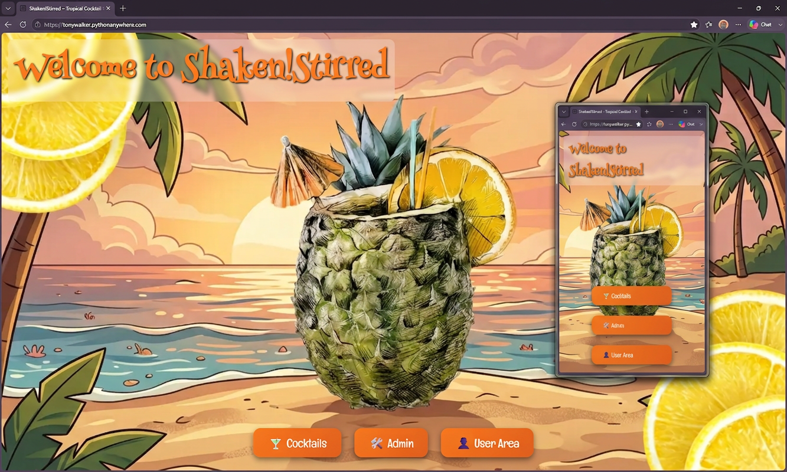

### Accessibility

The project follows recognised accessibility best practices, using semantic markup, high‑contrast visuals, descriptive alt text, and fully keyboard‑accessible navigation to support an inclusive user experience. ✔️

### POST — Add a Cocktail

To protect the integrity and consistency of the site’s content, users are encouraged to share their cocktail creations through the forum. This allows the admin to review submissions and decide which cocktails are formally added to the main database. ✔️

### Administration — Manage User Cocktails

A full and comprehensive admin system has been implemented to manage all cocktail data, including validation, error checking, and controlled publishing. This ensures the site remains accurate, consistent, and protected from incorrect or duplicate submissions. ✔️

### Search Form — Find Cocktails by Ingredient

The reverse‑lookup system allows users to choose a single ingredient and instantly see every cocktail that uses it. This provides a quick and intuitive way to explore drinks based on what the user already has available. ✔️

### Cocktail Information — View Full Cocktail Details 

The cocktail page displays full drink details using bold, eye‑catching imagery and a well‑structured cocktail card, making it easy for users to explore each drink in depth. ✔️

### Feedback — Collect User Feedback

User feedback is gathered through the integrated forum, allowing visitors to share thoughts, ideas, and cocktail submissions in an open and structured space. This provides a simple and effective way for users to communicate with the site while keeping all feedback organised and easy to review. ✔️

### Contact Information

As a “should‑have” requirement, contact functionality is addressed through the user forum. This provides a central, moderated space where users can post questions, share ideas, and communicate with the site, without exposing direct contact details or compromising the integrity of the platform. ✔️

### Image Buttons — Open Cocktail Details

The bespoke cocktail images act as interactive buttons, giving users a visually engaging way to explore each drink. These image‑driven controls make full use of responsive grids and modal windows, ensuring the experience feels smooth, modern, and intuitive across all devices. ✔️

### Testing Summary  

All user stories have been fully reviewed and tested to confirm that each requirement has been successfully addressed. Every feature — from cocktail management to search, feedback, and responsive design — has been validated to ensure the site behaves as intended across all devices.

## Navigation

### Index Page
- ➡️ Cocktails.html ✔️
- ➡️ Admin.html ✔️
- ➡️ User.Html ✔️

### Cocktail Page
- ➡️ Index.html ✔️

### Admin Page
- ➡️ Index.html ✔️
- ➡️ ( New Tab ) Testdata.html ✔️

### User Page
- ➡️ Index.html ✔️
- ➡️ User Forum.html ✔️

### User Forum Page
- ➡️ User.html ✔️

## Use of Validators in a Django Project

### Overview
During development I used HTML, CSS, and JavaScript validators to check the quality and correctness of my code. However, Django templates contain server‑side syntax such as:



 ... 

{{ variable }}

Template inheritance blocks

These are not valid HTML or JavaScript until Django renders them. Because of this, online validators often report errors that are not genuine issues.

### ⚠️ Why Validators Misinterpret Django Templates

When a validator encounters Django template syntax, it attempts to parse it as raw HTML or JavaScript. This leads to false errors such as:

- “Illegal character { in attribute”

- “Stray start tag html”

- “Missing `<title>` element”

- “Unexpected token”

- “Duplicate IDs”

- “Cannot recover after last error”

These errors occur because the validator is reading template code, not the final rendered HTML.

### 🔍 Correct Validation Method
To validate Django pages properly, I validated the rendered output, not the template source.

Steps taken:
- Opened the page in the browser.

- Used View Page Source to capture the fully rendered HTML.

- Submitted that HTML to the validator.

- Confirmed that all genuine HTML issues were resolved.

This method ensures the validator sees the actual HTML that the browser receives — without Django syntax.

### 🛠️ Genuine Issues Identified & Fixed
Any real issues flagged by validators or browser dev tools were corrected, including:

*Some real examples*
- Adding `<!DOCTYPE html>`

- Adding `<html lang="en">`

- Removing trailing slashes from void elements

- Correcting heading hierarchy

- Improving ARIA labels and modal accessibility

- Ensuring unique IDs

- Moving `<script>` inside <body>

- Ensuring keyboard accessibility for interactive elements

All legitimate warnings were addressed.

### 🧪 Final Testing
After validation, pages are tested thoroughly using:

- Chrome DevTools

- Firefox Developer Edition

- Responsive/mobile view

- Keyboard‑only navigation

- Screen reader checks (NVDA / VoiceOver)

Ensuring all functionality work as expected:
- Modal opens and closes correctly

- Keyboard navigation triggers modal correctly

- ARIA labels announce content properly

- Images load with fallbacks

- No console errors

- No accessibility blockers

### 📌 Conclusion
HTML/JS validators and Django templates do not mix, because validators cannot interpret Django’s server‑side syntax. By validating the rendered HTML and addressing all genuine issues, the final pages are:

- structurally correct

- accessible

- standards‑compliant

- fully functional after testing

This demonstrates responsible use of validation tools within a Django development workflow and where ever possible due to size limitations screenshots are provided.

## Validator

### index.html

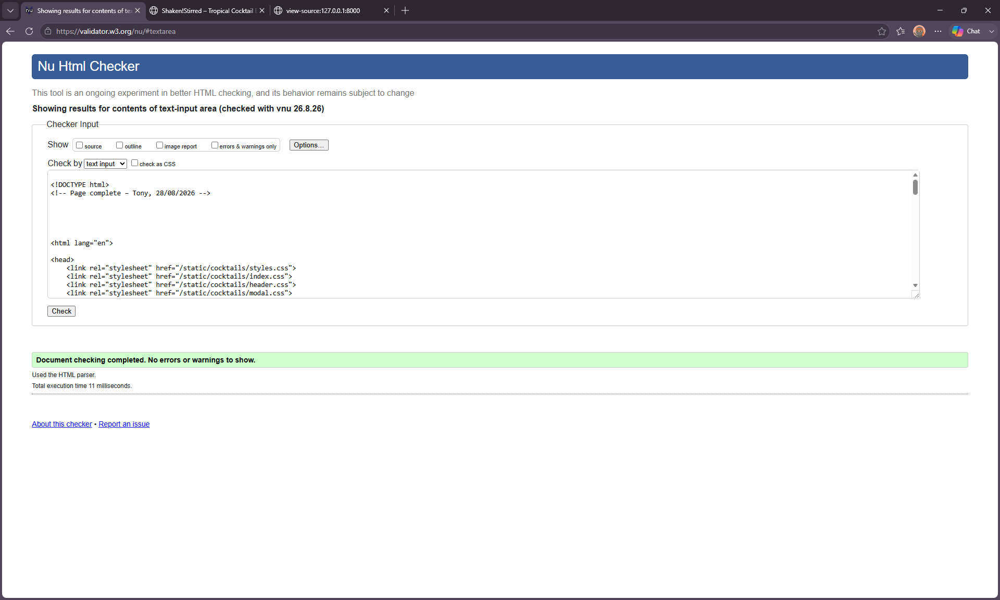

**
✔️ No warnings
**

### cocktail_list.html

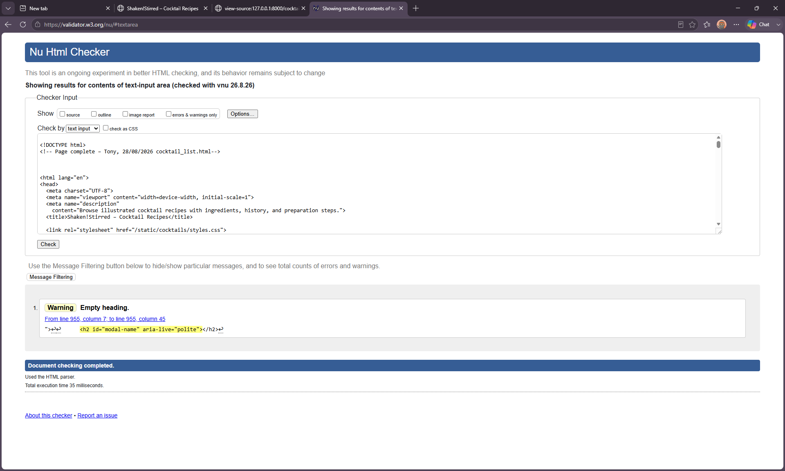

**
⚠️ Warning
**

The modal heading (`<h2 id="modal-name">`) is intentionally empty in the static HTML because its content is injected dynamically. This follows standard accessible modal patterns: the heading acts as a placeholder and is updated at runtime, with aria-live="polite" ensuring screen readers announce the change. 

**
📌 Conclusion
**

Since the heading is populated immediately upon modal activation, it does not create any accessibility issues, and the validator warning can be safely ignored.

### iframe ingredients lookup

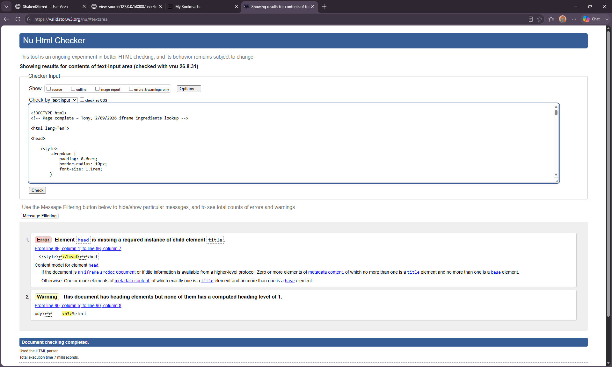

**
⚠️ Warning
**

Some HTML validator warnings were intentionally ignored because the pages are rendered inside an iframe and are not standalone documents. The iframe content acts as a UI component rather than a full webpage, so requirements such as a `<title>` element or top‑level `<h1>` heading do not apply.

📌 Conclusion

These warnings do not affect functionality or accessibility, as the parent document provides the overall page structure.

### iframe cocktail lookup

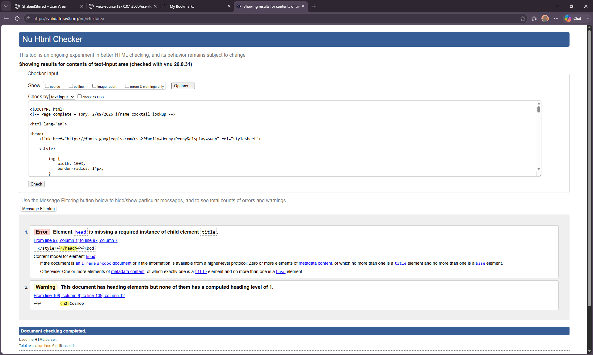

**
⚠️ Warning
**

Validator Warnings (Iframe Child Page)
The HTML validator reports missing `<title>` and missing `<h1>` heading for the iframe child page. These warnings were intentionally ignored because the iframe content is not a standalone webpage. It is embedded inside the parent document, which already provides the required page‑level metadata and heading structure.

**
📌 Conclusion
**

The iframe acts only as a UI component, so document‑level requirements do not apply and the warnings have no impact on functionality or accessibility.

### forum.html

**
✔️ No warnings
**

### thread_detail.html

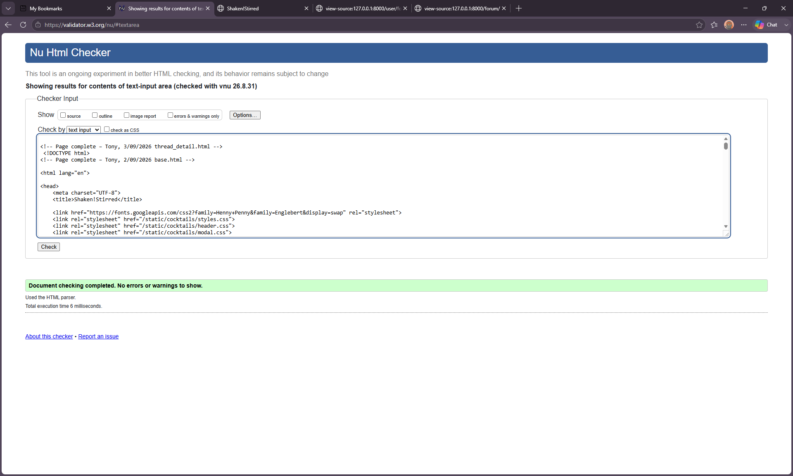

**
✔️ No warnings
**

### new_thread.html

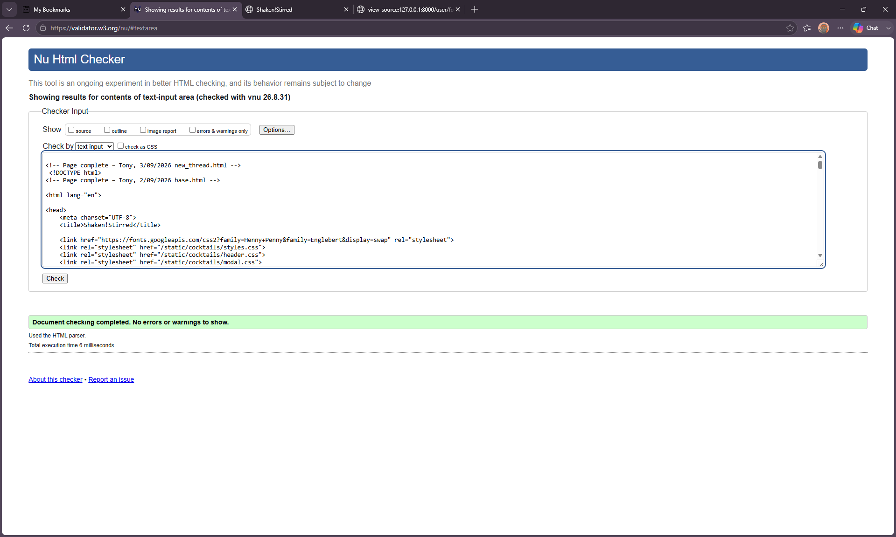

**
✔️ No warnings
**

### user.html

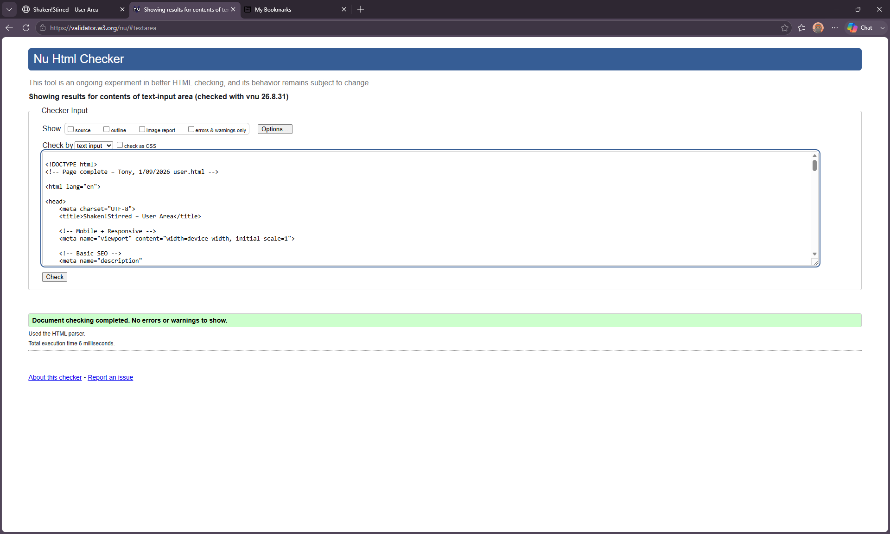

**
✔️ No warnings
**

### testdata.html

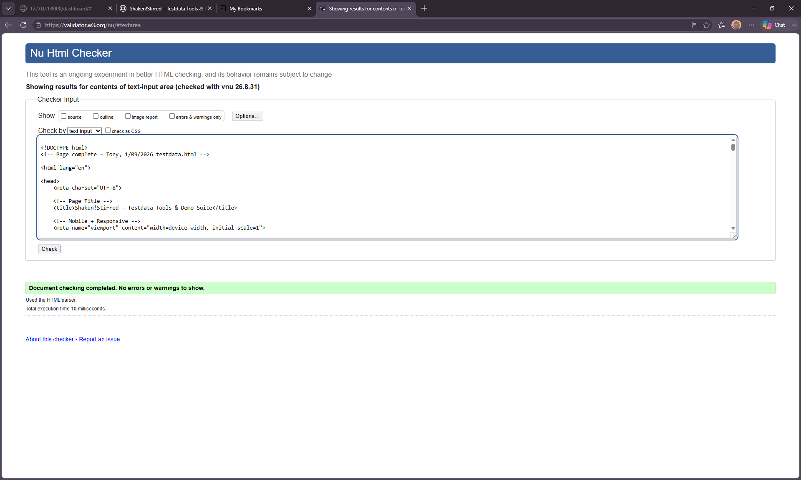

**
✔️ No warnings
**

### admin.html

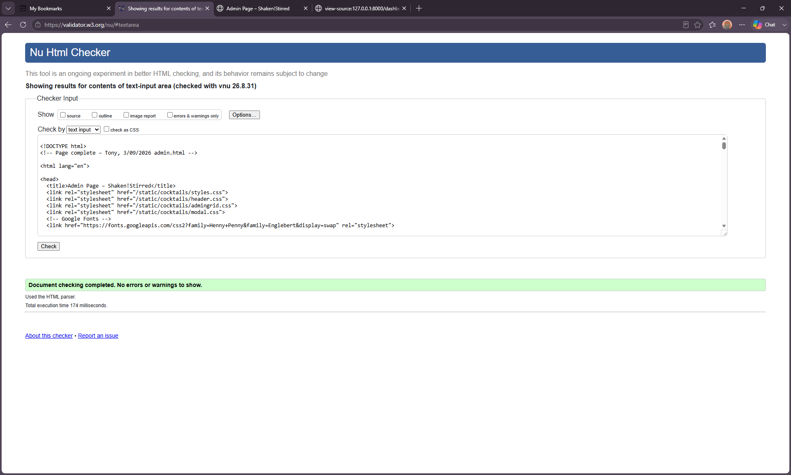

**
✔️ No warnings
**

## JavaScript Validation (ESLint v9+)

- Installed and configured ESLint using the new eslint.config.js format

- Added ignore rules for Django admin JS, vendor scripts, jQuery, and virtual environment

- Enabled ES2021 syntax and browser globals

- Ran ESLint across all project JavaScript files

- Result: 0 errors, 6 warnings

- Warnings related only to unused imports and unused variables

- No functional issues detected

- Confirms that the JavaScript codebase is clean, modern, and stable

### ESLint output

C:\projects\shaken-not-stirred\static\js\admin\add.js
  3:3  warning  'closeModal' is defined but never used  no-unused-vars
  4:3  warning  'openModal' is defined but never used   no-unused-vars

C:\projects\shaken-not-stirred\static\js\admin\customise.js
  3:3  warning  'closeModal' is defined but never used  no-unused-vars

C:\projects\shaken-not-stirred\static\js\admin\history.js
  5:3  warning  'getCSRFToken' is defined but never used  no-unused-vars

C:\projects\shaken-not-stirred\static\js\admin\recipes.js
    5:3   warning  'getCSRFToken' is defined but never used       no-unused-vars
  171:11  warning  'fullList' is assigned a value but never used  no-unused-vars

Ô£û 6 problems (0 errors, 6 warnings)

**
📌 Conclusion
**

 I reviewed each warning, removed the redundant code, and re‑ran the validator. ESLint now reports no errors and no warnings, confirming that the JavaScript codebase is clean, modern, and fully compliant with ES2021 standards.

**
✔️ No warnings
**

## 🐍 Python Validation (Ruff)

To ensure the Python codebase met modern linting and formatting standards, I validated the entire Django project using Ruff, a fast, all‑in‑one Python linter and formatter. Ruff combines checks from tools such as Pyflakes, pycodestyle, isort, and Flake8, making it ideal for maintaining a clean and consistent codebase.

### Installation

Ruff was installed inside the project’s virtual environment:

`pip install ruff`

### Configuration

I added a ruff.toml configuration file at the project root to define the linting rules and exclusions:

Line length set to 88 (matching Black and PEP8)

Target version set to Python 3.11

Enabled recommended rule sets: `E, F, W, B, I`

Excluded Django migration files

Added per‑file ignores for long‑line warnings (E501) in files where Django naturally produces long expressions (e.g., `urls.py, views.py, settings.py`)

This allowed Ruff to focus on meaningful issues without generating noise from unavoidable long lines.

### Fixes Applied

Running Ruff across the project identified several genuine issues, all of which were corrected:

Duplicate imports (e.g., models imported twice in `views.py`)

Unused imports (e.g., `timezone in models.py`)

Mid‑file imports moved to the top of the file (E402)

Unused variables renamed or removed (e.g., `_pk` in a loop)

Old development scripts removed (e.g., `static/testdata/del-views.py`)

Import blocks sorted and cleaned across the project

`ruff check . --fix`

For issues requiring manual intervention (such as removing duplicate functions or cleaning dev-only files), I updated the code directly.

## Result

After applying fixes and configuring exceptions, Ruff reports:

(.venv) PS C:\projects\shaken-not-stirred> ruff check .                   
All checks passed!

**
✔️ All checks passed!
**

## CSS Validator

### index.css

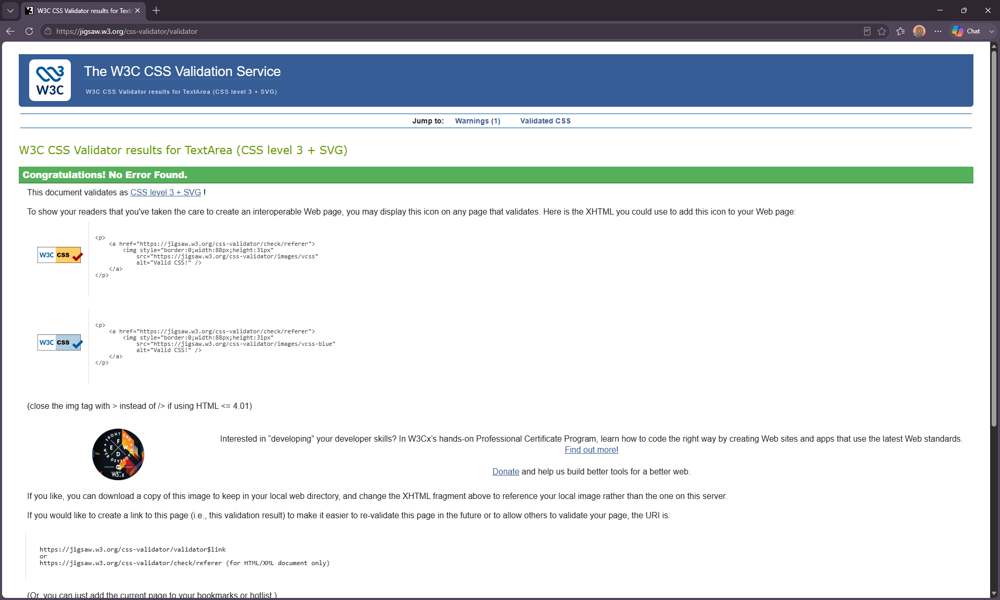

**
⚠️ Warnings
**

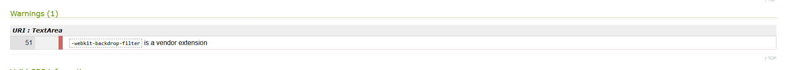

### Use of `-webkit-backdrop-filter`
The CSS validator flags `-webkit-backdrop-filter` as an error because vendor‑prefixed properties fall outside the formal CSS grammar it checks against. This does not mean the property is invalid or unsafe. The prefix exists because Safari’s rendering engine (WebKit) requires its own implementation of backdrop filtering, and without the prefixed version, the effect will not render on macOS or iOS devices.

Modern browsers that support the unprefixed `backdrop-filter` simply ignore the prefixed declaration, while Safari relies on it for full functionality. Because vendor extensions degrade gracefully—being ignored by engines that do not need them—they are considered a safe, standards‑compliant way to provide cross‑browser support for newer visual effects.

**
📌 Conclusion
**

This is not an error. It is a necessary vendor extension to ensure consistent behaviour across browsers, particularly Safari.

### testdata.css

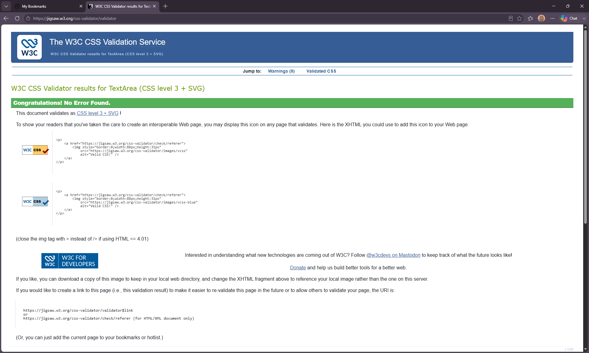

**
⚠️ Warnings
**

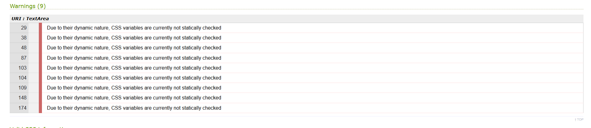

### CSS Variables Not Statically Checked

The CSS validator reports multiple notices stating that CSS variables (custom properties) are “not statically checked.” This is expected behaviour and not an error. CSS variables are resolved at runtime by the browser, not at validation time, which means the validator cannot fully analyse or verify their values. Because custom properties can change based on inheritance, media queries, JavaScript updates, or component scope, they fall outside the static grammar rules the validator uses. Browsers, however, handle them correctly and consistently.

**
📌 Conclusion
**

These notices simply indicate that the validator is acknowledging the dynamic nature of CSS variables rather than flagging a problem with the code.

### styles.css

**
⚠️ Warnings
**

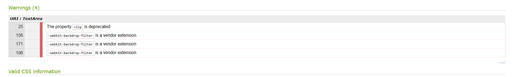

### Use of the Deprecated clip Property

The CSS validator flags the `clip` property as deprecated because modern CSS now prefers `clip-path` for defining clipping regions. However, the specific pattern used here—`clip: rect(0,0,0,0);`—is part of a long‑established accessibility technique known as the sr‑only pattern, designed to visually hide content while keeping it fully available to screen readers. Although `clip` is deprecated in general use, this pattern remains widely supported across browsers and is still recommended by major accessibility frameworks (including older versions of Bootstrap) for ensuring non‑visual users can access important content. The

Use of `-webkit-backdrop-filter`
[Previously explained here](#webkit)

**
📌 Conclusion
**

validator warning is therefore expected and does not indicate a functional or accessibility issue.

### modal.css

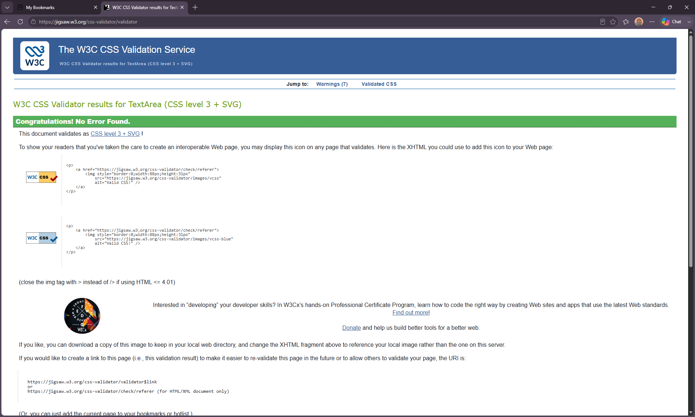
**
⚠️ Warnings
**

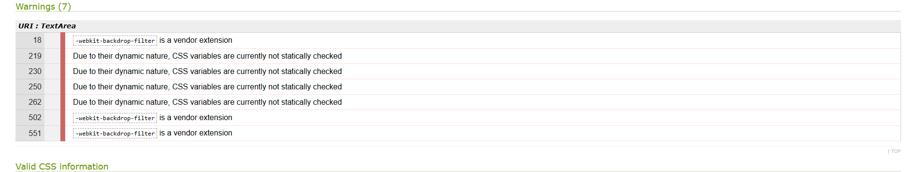

Use of `-webkit-backdrop-filter`
[Previously explained here](#webkit)

CSS Variables
[Previously explained here](#variables)

### user.css

**
⚠️ Warnings
**

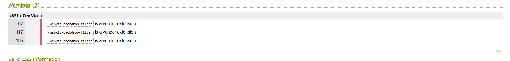

Use of `-webkit-backdrop-filter`
[Previously explained here](#webkit)

### base.css

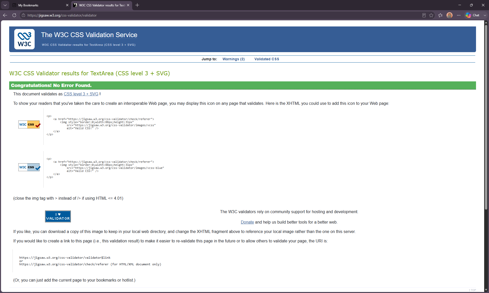
**
⚠️ Warnings
**

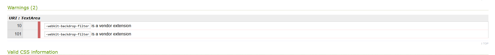

Use of `-webkit-backdrop-filter`
[Previously explained here](#webkit)

### ingredients_lookup.css

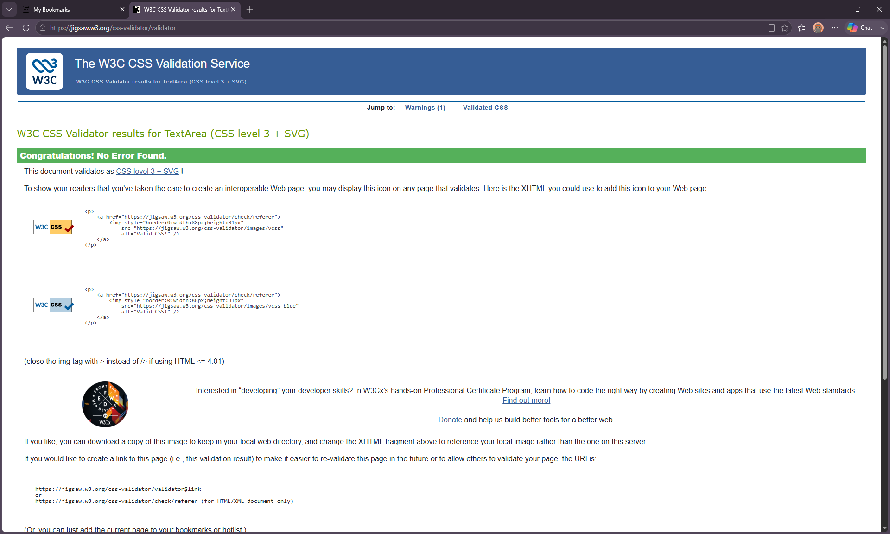
**
⚠️ Warnings
**

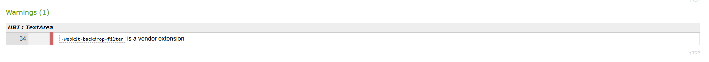

Use of `-webkit-backdrop-filter`
[Previously explained here](#webkit)

### lookup_cocktail_detail.css

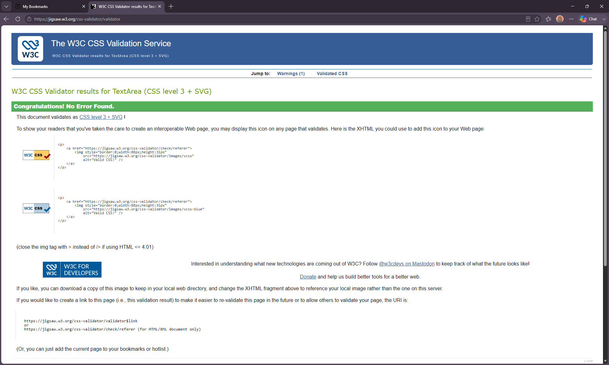
**
⚠️ Warnings
**

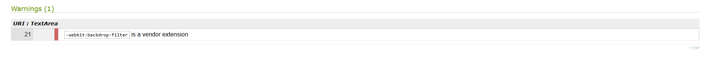

Use of `-webkit-backdrop-filter`
[Previously explained here](#webkit)